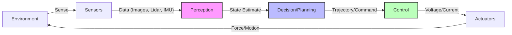
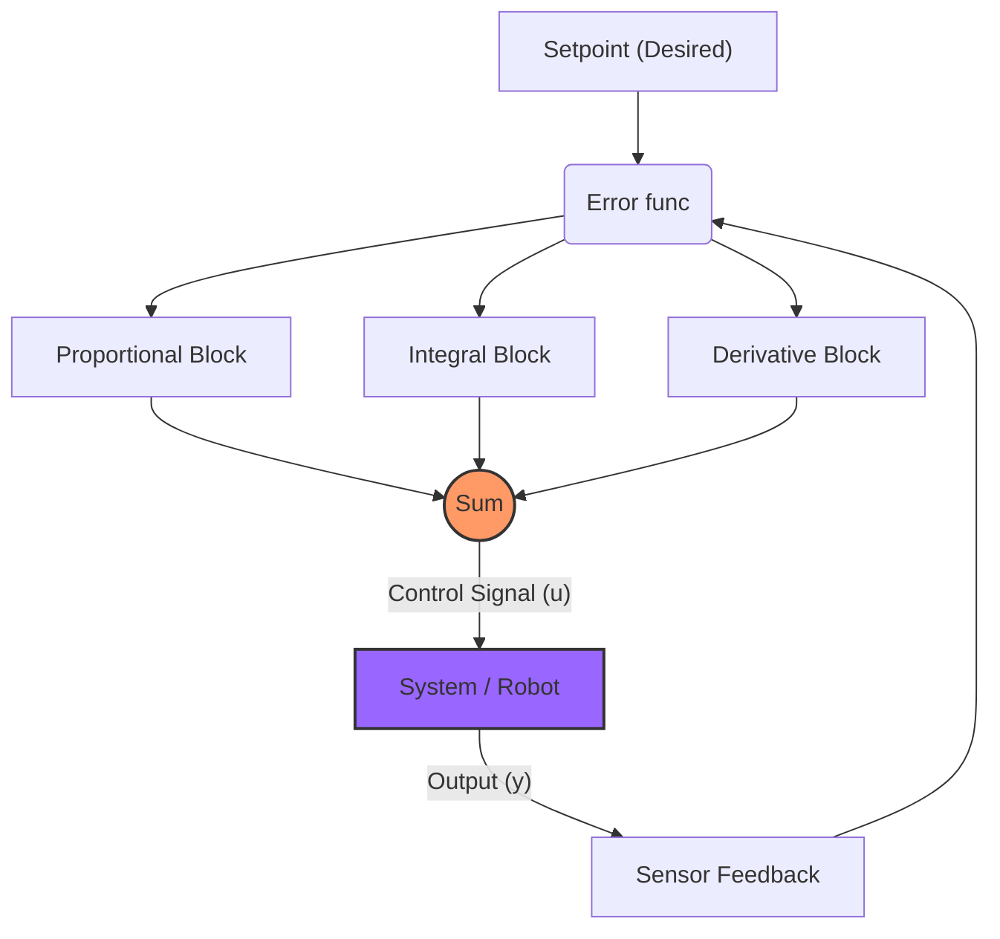

# Week 1-2: Foundations of Physical AI & Robotics Hardware

Welcome to the foundational module of Physical AI and Humanoid Robotics! Over the next two weeks, we will lay the groundwork for understanding how intelligent systems interact with the physical world. This module focuses on the core concepts of physical AI, the essential hardware components that make robots possible, and the mathematical underpinnings of robotics.

## Learning Objectives

By the end of this module, you should be able to:

1.  **Define Physical AI** and differentiate it from purely software-based AI.
2.  Identify and describe the **key hardware components** of a robot (actuators, sensors, end-effectors, controllers).
3.  Explain the basic principles of **robot kinematics and dynamics**.
4.  Understand the role of **control systems** in robotic manipulation.
5.  Discuss the importance of **safety and ethical considerations** in physical AI.

## 1. What is Physical AI?

Physical AI, or Embodied AI, refers to artificial intelligence systems that learn, reason, and act within a physical body or environment. Unlike AI that operates solely in virtual spaces (like image recognition or natural language processing on a server), physical AI requires robots to perceive, decide, and move in the real world.

Key characteristics:
*   **Embodiment**: The AI is integrated into a physical body (a robot).
*   **Interaction**: The robot physically interacts with its environment.
*   **Perception**: Uses sensors (cameras, LiDAR, force sensors) to understand the physical world.
*   **Actuation**: Uses motors and other actuators to perform physical actions.
*   **Real-world Challenges**: Deals with uncertainty, noise, delays, and dynamic environments.

### The Sense-Plan-Act Loop

## 2. Essential Robotics Hardware

A robot is a complex system of interconnected hardware components. Understanding these parts is crucial for designing and troubleshooting robotic systems.

### 2.1. Actuators

Actuators are the "muscles" of a robot, responsible for converting electrical, hydraulic, or pneumatic energy into mechanical motion.

*   **Motors**:
    *   **DC Motors**: Simple, common, control speed.
    *   **Servo Motors**: Precise control over angular position.
    *   **Stepper Motors**: Precise control over position, ideal for open-loop control.
    *   **Brushless DC (BLDC) Motors**: High efficiency, high power-to-weight ratio, common in drones and advanced robotics.
*   **Hydraulic/Pneumatic Actuators**: Used for high force applications, e.g., heavy industrial robots.
*   **Gearboxes**: Reduce speed and increase torque from motors.

#### Motor Comparison Table

| Motor Type | Pros | Cons | Typical Use Case |
| :--- | :--- | :--- | :--- |
| **DC Motor** | Simple, cheap, easy control | Low torque at high speed, brushes wear out | Wheels, fans, simple toys |
| **Servo Motor** | Precise position control, high torque | Limited rotation range (usually), complex control | Robot arms, grippers, steering |
| **Stepper Motor** | Precise positioning, high holding torque | Low efficiency, can lose steps, vibration | 3D printers, CNC machines |
| **BLDC Motor** | High efficiency, high power, low maintenance | Complex controller required (ESC), higher cost | Drones, Quadruped Robots, EVs |

### 2.2. Sensors

Sensors are the "eyes, ears, and touch" of a robot, providing information about the robot's internal state and external environment.

*   **Proprioceptive Sensors (Internal)**:
    *   **Encoders**: Measure joint angles and motor rotations (position feedback).
    *   **IMUs (Inertial Measurement Units)**: Accelerometers and gyroscopes to measure orientation and acceleration.
    *   **Force/Torque Sensors**: Measure forces and torques applied at joints or end-effectors.
*   **Exteroceptive Sensors (External)**:
    *   **Cameras (2D/3D)**: Vision for object recognition, pose estimation, mapping.
        *   RGB, Depth (e.g., Intel RealSense, Azure Kinect), Stereo.
    *   **LiDAR (Light Detection and Ranging)**: 3D mapping and obstacle detection using lasers.
    *   **Ultrasonic Sensors**: Proximity detection.
    *   **Proximity Sensors**: Detect presence of objects without contact.
    *   **Microphones**: Sound detection, speech recognition.

### 2.3. End-Effectors

The "hands" or "tools" of a robot, designed to interact with the environment or manipulate objects.

*   **Grippers**: Parallel jaw, 3-finger, vacuum.
*   **Tools**: Welders, paint sprayers, drills, screwdrivers.
*   **Specialized devices**: Medical instruments, sampling tools.

### 2.4. Controllers

The "brain" of the robot, responsible for processing sensor data, executing algorithms, and sending commands to actuators.

*   **Microcontrollers (MCUs)**: For low-level motor control, sensor reading.
*   **Single-Board Computers (SBCs)**: E.g., Raspberry Pi, NVIDIA Jetson - for higher-level AI, perception, navigation.
*   **Industrial PCs**: High-performance computing for complex tasks in industrial settings.

## 3. Kinematics and Dynamics (Basic Introduction)

### 3.1. Kinematics

Deals with the geometry of motion without considering the forces that cause the motion.

*   **Forward Kinematics**: Given joint angles, calculate the end-effector's position and orientation.
*   **Inverse Kinematics**: Given a desired end-effector position and orientation, calculate the required joint angles. This is often more complex due to multiple solutions or singularities.

### 3.2. Dynamics

Deals with the forces and torques that cause motion.

*   Relates joint torques/forces to resulting motion (accelerations) and vice versa, considering mass, inertia, and external forces.
*   Crucial for understanding how much force is needed to move a robot arm or how it reacts to external disturbances.

## 4. Control Systems

Robots use control systems to achieve desired behaviors, maintain stability, and interact safely.

*   **Open-loop control**: No feedback from the system. E.g., sending a fixed voltage to a motor.
*   **Closed-loop control (Feedback Control)**: Uses sensor feedback to adjust actions.
    *   **PID (Proportional-Integral-Derivative) Controllers**: A widely used feedback control loop mechanism.
        *   **P (Proportional)**: Responds to the current error.
        *   **I (Integral)**: Responds to accumulated error over time.
        *   **I (Integral)**: Responds to accumulated error over time.
        *   **D (Derivative)**: Responds to the rate of change of error.

### Visualizing PID Control

## 5. Safety and Ethical Considerations

As robots become more autonomous and interactive, safety and ethical design are paramount.

*   **Physical Safety**: Preventing harm to humans and damage to property.
    *   Emergency stop systems, safety zones, force limits.
*   **Data Privacy**: What data do robots collect, and how is it used?
*   **Decision-Making**: How should robots make decisions in ambiguous or morally complex situations?
*   **Bias**: Ensuring AI models in robots are fair and unbiased.

## Conclusion

This module provided a comprehensive overview of Physical AI's foundations, the critical hardware components, and the basic principles of robotics mechanics and control. Armed with this knowledge, you are ready to delve deeper into specific robotic frameworks and advanced AI techniques.

## Further Reading

*   **Textbook**: "Introduction to Robotics: Mechanics and Control" by John J. Craig
*   **Online Course**: Coursera: "Robotics: Aerial Robotics" (covers foundational concepts applicable to ground robots as well)
*   **Resource**: ROS (Robot Operating System) documentation for practical examples of hardware integration.
