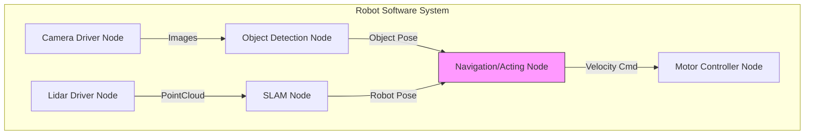
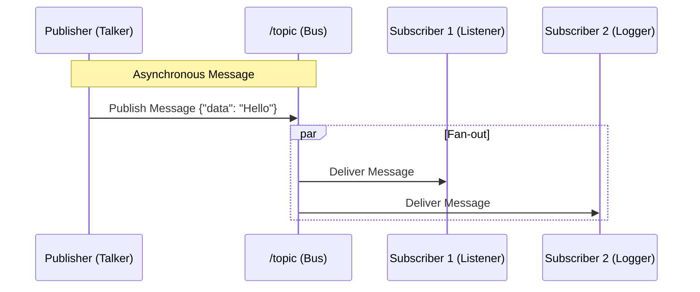

# Week 3: ROS2 Nodes & Topics - The Backbone of Robotic Communication

Welcome to Module 1: ROS2! This week, we dive into the fundamental communication mechanisms of the Robot Operating System 2: **Nodes and Topics**. These concepts are crucial for understanding how different software components in a robotic system communicate and cooperate.

## Learning Objectives

By the end of this week, you should be able to:

1.  **Understand the role of ROS2** as a robotic middleware.
2.  Define **ROS2 Nodes** and explain their purpose in modular robot software.
3.  Implement a basic **ROS2 Node** in Python.
4.  Define **ROS2 Topics** and describe the publish-subscribe communication model.
5.  Create a **ROS2 Publisher** and **Subscriber** to exchange messages via topics.
6.  Utilize `ros2` command-line tools for inspecting nodes and topics.

## 1. Introduction to ROS2

ROS2 (Robot Operating System 2) is a flexible framework for writing robot software. It provides libraries, tools, and conventions that simplify the task of creating complex robotic applications. Unlike its predecessor ROS1, ROS2 is built on DDS (Data Distribution Service), offering improved real-time capabilities, security, and multi-platform support.

Key advantages of ROS2:
*   **Modularity**: Break down complex robot behaviors into smaller, manageable components.
*   **Distribution**: Components can run on different machines across a network.
*   **Reusability**: Write code once and reuse it across multiple robot platforms or projects.
*   **Scalability**: Easily add or remove components as needed.

## 2. ROS2 Nodes: The Building Blocks

A **ROS2 Node** is an executable process that performs a specific, focused task. Think of nodes as individual programs or services that make up your robot's entire software system. For example, one node might control a motor, another might process camera data, and a third might handle navigation planning.

Each node in ROS2 should ideally be responsible for a single logical module, promoting a clean, modular architecture.
    


### Creating a Simple Python Node

Let's create a simple "Hello World" node using Python. First, ensure you have a ROS2 workspace sourced.

```python
# my_robot_pkg/my_robot_pkg/simple_node.py
import rclpy
from rclpy.node import Node

class SimpleNode(Node):

    def __init__(self):
        super().__init__('simple_node') # Initialize the node with the name 'simple_node'
        self.get_logger().info('Simple Node has been started!')

    def __del__(self):
        self.get_logger().info('Simple Node has been stopped!')

def main(args=None):
    rclpy.init(args=args)
    node = SimpleNode()
    rclpy.spin(node) # Keep the node alive until Ctrl+C is pressed
    node.destroy_node()
    rclpy.shutdown()

if __name__ == '__main__':
    main()
```

To make this node executable:
1.  Create a ROS2 Python package (e.g., `ros2 pkg create --build-type ament_python my_robot_pkg`).
2.  Place the above code in `my_robot_pkg/my_robot_pkg/simple_node.py`.
3.  Add an entry point in `my_robot_pkg/setup.py` under `entry_points`:
    ```python
    # setup.py snippet
    entry_points={
        'console_scripts': [
            'simple_node = my_robot_pkg.simple_node:main',
        ],
    },
    ```
4.  Build your workspace (`colcon build --packages-select my_robot_pkg`).
5.  Source your workspace (`source install/setup.bash`).
6.  Run the node (`ros2 run my_robot_pkg simple_node`).

## 3. ROS2 Topics: Asynchronous Communication

**Topics** are the most common way for nodes to exchange messages. They implement a **publish-subscribe** communication model. A node (publisher) sends messages to a topic, and any other node (subscriber) interested in that data can receive messages from the same topic.

*   **Asynchronous**: Publishers and subscribers don't need to be running at the same time or know about each other directly.
*   **Message Types**: Each topic has a defined message type (e.g., `std_msgs/String`, `geometry_msgs/Twist`), ensuring data consistency.
*   **Decoupling**: Nodes are loosely coupled, making the system more robust and easier to develop.

#### The Publish-Subscribe Pattern



### Creating a Publisher and Subscriber

Let's create a publisher node that sends string messages and a subscriber node that receives them.

#### Publisher Node (`my_robot_pkg/my_robot_pkg/publisher_node.py`)

```python
import rclpy
from rclpy.node import Node
from std_msgs.msg import String # Import standard string message type

class MinimalPublisher(Node):

    def __init__(self):
        super().__init__('minimal_publisher')
        # Create a publisher: topic type, topic name, queue size
        self.publisher_ = self.create_publisher(String, 'topic', 10)
        self.i = 0
        # Create a timer to call timer_callback every 0.5 seconds
        self.timer = self.create_timer(0.5, self.timer_callback)
        self.get_logger().info('Publisher node started!')

    def timer_callback(self):
        msg = String()
        msg.data = f'Hello ROS2! Count: {self.i}'
        self.publisher_.publish(msg)
        self.get_logger().info(f'Publishing: "{msg.data}"')
        self.i += 1

def main(args=None):
    rclpy.init(args=args)
    minimal_publisher = MinimalPublisher()
    rclpy.spin(minimal_publisher)
    minimal_publisher.destroy_node()
    rclpy.shutdown()

if __name__ == '__main__':
    main()
```

#### Subscriber Node (`my_robot_pkg/my_robot_pkg/subscriber_node.py`)

```python
import rclpy
from rclpy.node import Node
from std_msgs.msg import String

class MinimalSubscriber(Node):

    def __init__(self):
        super().__init__('minimal_subscriber')
        # Create a subscriber: topic type, topic name, callback function, queue size
        self.subscription = self.create_subscription(
            String,
            'topic',
            self.listener_callback,
            10)
        self.subscription # prevent unused variable warning
        self.get_logger().info('Subscriber node started!')

    def listener_callback(self, msg):
        self.get_logger().info(f'I heard: "{msg.data}"')

def main(args=None):
    rclpy.init(args=args)
    minimal_subscriber = MinimalSubscriber()
    rclpy.spin(minimal_subscriber)
    minimal_subscriber.destroy_node()
    rclpy.shutdown()

if __name__ == '__main__':
    main()
```

To run these:
1.  Update `my_robot_pkg/setup.py` with entry points for both `publisher_node` and `subscriber_node`.
2.  Build and source your workspace.
3.  Open two terminals:
    *   Terminal 1: `ros2 run my_robot_pkg publisher_node`
    *   Terminal 2: `ros2 run my_robot_pkg subscriber_node`

You should see messages being published in one terminal and received in the other.

## 4. Inspecting ROS2 Communication (CLI Tools)

ROS2 provides powerful command-line tools to inspect your running system:

*   `ros2 node list`: Lists all active nodes.
*   `ros2 topic list`: Lists all active topics.
*   `ros2 topic info <topic_name>`: Shows publisher/subscriber count and message type for a topic.
*   `ros2 topic echo <topic_name>`: Displays messages being published on a topic in real-time.
*   `ros2 topic pub <topic_name> <msg_type> <args>`: Manually publish a message to a topic.

These tools are invaluable for debugging and understanding the flow of data in your robotic system.
    
### ROS2 CLI Cheat Sheet

| Command | Action | Example Usage |
| :--- | :--- | :--- |
| `ros2 node list` | Show all running nodes | `ros2 node list` |
| `ros2 node info` | Show details of a specific node | `ros2 node info /my_node` |
| `ros2 topic list` | List active topics | `ros2 topic list -v` (verbose) |
| `ros2 topic echo` | Print messages to console | `ros2 topic echo /cmd_vel` |
| `ros2 topic hz` | Measure publishing rate | `ros2 topic hz /camera/image_raw` |
| `ros2 interface show` | Show message structure | `ros2 interface show sensor_msgs/msg/Image` |

## Conclusion

This week, we've covered the foundational concepts of ROS2 nodes and topics. You now understand how to structure your robotic software into modular nodes and enable them to communicate asynchronously using topics. This publish-subscribe pattern is central to ROS2 and allows for highly distributed and flexible robotic applications. Next week, we will explore other essential ROS2 communication patterns: Services and Actions.

## Further Reading

*   **ROS2 Documentation**: [Understanding ROS2 Nodes](https://docs.ros.org/en/humble/Tutorials/Beginner-CLI-Tools/Understanding-ROS2-Nodes/Understanding-ROS2-Nodes.html)
*   **ROS2 Documentation**: [Understanding ROS2 Topics](https://docs.ros.org/en/humble/Tutorials/Beginner-CLI-Tools/Understanding-ROS2-Topics/Understanding-ROS2-Topics.html)
